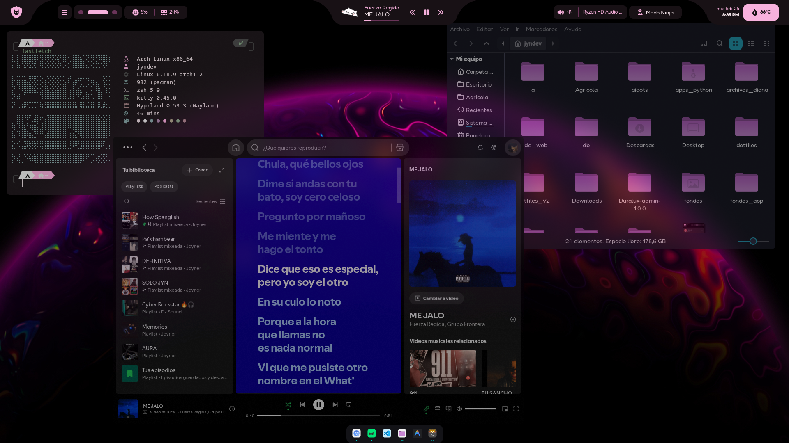
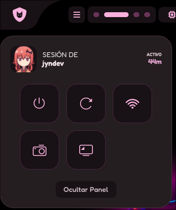
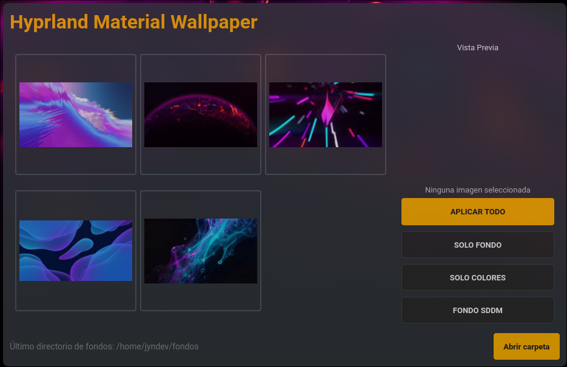
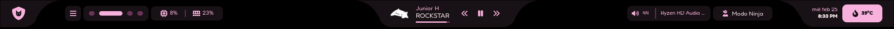
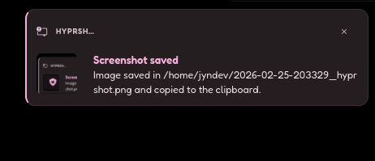

<h1 align="center">
  <br>
  <a href="https://www.tiktok.com/@jyndev"></a>
  <br>
  JynDev - Dotfiles 🐱
  <br>
</h1>

<p align="center">
  <i align="center">"No es solo un entorno, es tu reflejo. ¿Te animas a moldearlo? 🩵" - Jyn</i>
  <br><br>
  Mis redes sociales:
  <br>
  <a href="https://www.tiktok.com/@jyndev"></a>
  <a href="https://discord.gg/Khkbk4FjsA"></a>
</p>

---

<h2 align="center">✨ Vistazo Principal</h2>

<p align="center">
  
</p>

### 🎯 Componentes Destacados

<div align="center">
  <table>
    <tr>
      <td align="center"><b>Centro de Control Interactivo</b><br><br></td>
      <td align="center"><b>App de Fondos Personalizada</b><br><br></td>
    </tr>
    <tr>
      <td align="center"><b>Nueva Barra Superior (AGS)</b><br><br></td>
      <td align="center"><b>Sistema de Notificaciones Moderno</b><br><br></td>
    </tr>
  </table>
</div>

---

## 🚀 Dotfiles - Takanashi Version 🌠

Bienvenido a mi colección actualizada de **dotfiles** y configuraciones personalizadas para **Arch Linux** con **Hyprland**. En esta nueva versión, hemos dado un gran salto: **hemos reemplazado Waybar, Eww y Cava** en favor de **AGS (Aylur's GTK Shell)** y **Kitty** como terminal principal, ofreciendo un entorno mucho más rápido, dinámico y cohesivo.

> ⚠️ **Advertencia importante**  
> Estos **dotfiles** están basados en **mi configuración de trabajo personal**.  
> Todas las decisiones aquí reflejan mis preferencias, pero el código está hecho para que lo modifiques. ¡Siéntete libre de adaptarlo a tu flujo de trabajo!

## 🛡️ Pre-requisitos

1. **Arch Linux** base instalado con **Hyprland** gráfico funcionando.
2. Eliminar cualquier **gestor de notificaciones** previo (Mako, Dunst, etc.) ya que AGS se encarga de esto.
3. Eliminar configuraciones anteriores de *Waybar*, *Eww* y *Cava* si vienes de la versión anterior.

---

## ⚙️ Guía de Instalación para Novatos

Sigue estos pasos en orden para asegurar una instalación exitosa y sin errores.

### 1️⃣ Shell y Utilidades Básicas

Asegúrate de tener `git` y `zsh` para gestionar todo el sistema de manera cómoda:

```bash
sudo pacman -S git zsh
```

**Cambia tu shell por defecto a ZSH:**
```bash
chsh -s /bin/zsh
```

**Instala yay (Gestor de paquetes AUR):**
Este paso es crucial para descargar herramientas de la comunidad.
```bash
sudo pacman -S --needed base-devel
git clone https://aur.archlinux.org/yay.git
cd yay && makepkg -si
```
*(Es recomendable reiniciar sesión rápido o abrir una nueva terminal tras este paso).*

---

### 2️⃣ Instalación de Paquetes Necesarios

Hemos optimizado las dependencias. Ahora usamos `kitty` como terminal y `ags` para la interfaz.

**Paquetes Oficiales (Pacman):**
```bash
sudo pacman -S kitty gnome-tweaks swww fastfetch rofi-wayland nemo cinnamon-translations ttf-jetbrains-mono-nerd zenity bc eog gnome-system-monitor evince xdg-desktop-portal-hyprland xdg-desktop-portal-gtk ffmpeg ttf-nunito nemo-fileroller
```

**Paquetes de la Comunidad (AUR):**
*(Usamos el comando simple de yay, y elegimos aylurs-gtk-shell como provedor principal de ags).*
```bash
yay -S aylurs-gtk-shell hyprshot visual-studio-code-bin mpvpaper matugen-bin ttf-fredoka-one hypr-dock youtube-music
```

---

### 3️⃣ Aplicando los Dotfiles

Clona este repositorio (si no lo has hecho aún) y mueve las configuraciones.

1. **Copia la carpeta config:**
   Copia todo el contenido de la carpeta `config` de este repositorio hacia tu carpeta personal `~/.config/`:
   ```bash
   cp -r config/* ~/.config/
   ```

2. **Crea los directorios de caché esenciales:**
   El gestor de temas y la pantalla de bloqueo necesitan estas carpetas para evitar errores en su primer arranque.
   ```bash
   mkdir -p ~/.cache/hyprlock ~/.cache/albumart ~/.cache/liveWallpaper
   ```

---

### 4️⃣ Temas, Iconos y Fuentes (Estética)

Para que el sistema luzca igual a las capturas, asegúrate de tener aplicados los entornos GTK correctos a través de `gnome-tweaks` (Retoques) o herramientas predefinidas:

* 🏙️ **Iconos:** `Magna-Dark-Icons`
* 🖍️ **Tema GTK:** `Lavanda-gtk-theme`
* 🗚 **Fuente principal GTK:** `Fredoka`
* 🖱️ **Cursor:** `Anya-cursor-v3`

**Fuentes adicionales para símbolos y caracteres asiáticos:**
```bash
sudo pacman -S noto-fonts-cjk noto-fonts-emoji noto-fonts
```

---

### 5️⃣ Iniciando el Entorno (Primer Arranque)

Dado que usamos **Matugen** para generar colores dinámicos basados en tu fondo de pantalla, es fundamental inicializarlo una vez antes de que AGS inicie por completo o se verá sin colores.

Ejecuta manualmente para generar el primer esquema de color:
```bash
matugen image "/ruta/a/tu/imagen/favorita.jpg"
```
*(Sustituye la ruta por la imagen que hayas configurado como fondo).*

---

## 🔒 Estilo de Login: Tema SDDM (Opcional)

> ⚠️ Todos los créditos a su respectivo autor: [ii-sddm-theme](https://github.com/3d3f/ii-sddm-theme)

Si usas SDDM como gestor de inicio de sesión, puedes instalar este tema genial:

1. **Dependencias:**
   ```bash
   yay -S --needed sddm qt6-svg qt6-virtualkeyboard qt6-multimedia-ffmpeg otf-space-grotesk ttf-gabarito-git ttf-material-symbols-variable-git ttf-readex-pro ttf-rubik-vf
   ```

2. **Instalación de la carpeta del tema:**
   ```bash
   sudo cp -r ii-sddm-theme /usr/share/sddm/themes/
   ```

3. **Permisos y enlaces (Para sincronizar el fondo y color):**
   ```bash
   sudo chmod 777 /usr/local/etc
   mkdir -p /usr/local/etc/sddm
   sudo ln -s /usr/local/etc/sddm/sddm_background /usr/share/sddm/themes/ii-sddm-theme/Backgrounds/background
   sudo ln -s /usr/local/etc/sddm/sddm_config_colors /usr/share/sddm/themes/ii-sddm-theme/Components/Colors.qml
   ```
   *Nota: Al cambiar fondos desde la control center, estos enlaces se encargarán de actualizar tu pantalla de login.*

---

## 🌎 Optimización de Apps en Wayland

Para garantizar que Electron y navegadores fluyan suaves, es recomendable agregar estos flags (como opciones de ejecución) a tus lanzadores (`.desktop`):

**Chrome / Edge:**
```bash
--ozone-platform=wayland
```

**VS Code:**
```bash
--enable-features=WaylandWindowDecorations --ozone-platform=wayland
```

---

<p align="center">
  <b>✅ ¡Listo! Disfruta de tu nuevo entorno de escritorio. No olvides recargar Hyprland y AGS. 🚀</b>
</p>
